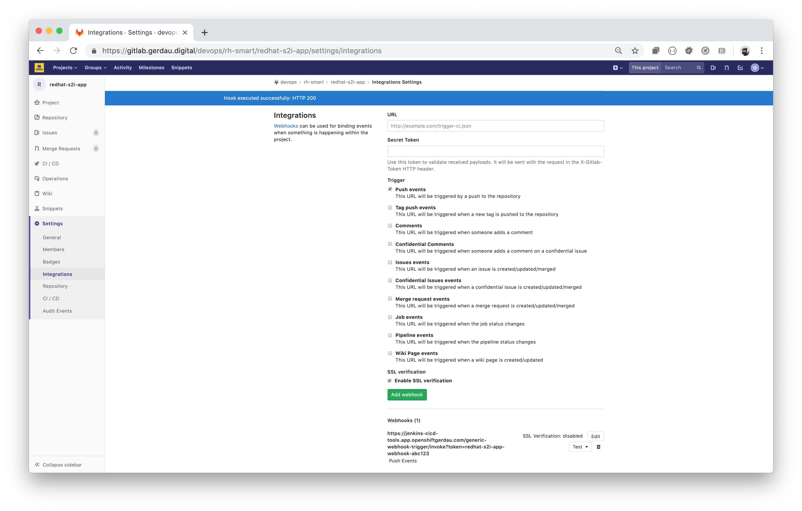

## Gitlab URL
https://jenkins-cicd-tools.app.mycompany.com/generic-webhook-trigger/invoke?token=abc123

### Ref Jenkins - Generic Trigger
```
^(refs/heads/develop|refs/tags/.+|refs/heads/feature/.+)$
^(refs/heads/develop|refs/heads/master|refs/heads/feature/.+)​$
```

## Testando JSONPATH
https://github.com/json-path/JsonPath


## Gitlab

https://jenkins-cicd-tools.app.mycompany.com/generic-webhook-trigger/invoke?token=redhat-s2i-app-webhook-abc123



## Test

```shell
# /consultoria/gerdau-sp/gitlab-webhook
$ ./curl.sh
*   Trying 3.221.71.28...
* TCP_NODELAY set
* Connected to jenkins-cicd-tools.app.mycompany.com (3.221.71.28) port 443 (#0)
* ALPN, offering h2
* ALPN, offering http/1.1
* Cipher selection: ALL:!EXPORT:!EXPORT40:!EXPORT56:!aNULL:!LOW:!RC4:@STRENGTH
* successfully set certificate verify locations:
*   CAfile: /etc/ssl/cert.pem
  CApath: none
* TLSv1.2 (OUT), TLS handshake, Client hello (1):
* TLSv1.2 (IN), TLS handshake, Server hello (2):
* TLSv1.2 (IN), TLS handshake, Certificate (11):
* TLSv1.2 (IN), TLS handshake, Server key exchange (12):
* TLSv1.2 (IN), TLS handshake, Server finished (14):
* TLSv1.2 (OUT), TLS handshake, Client key exchange (16):
* TLSv1.2 (OUT), TLS change cipher, Client hello (1):
* TLSv1.2 (OUT), TLS handshake, Finished (20):
* TLSv1.2 (IN), TLS change cipher, Client hello (1):
* TLSv1.2 (IN), TLS handshake, Finished (20):
* SSL connection using TLSv1.2 / ECDHE-RSA-AES128-GCM-SHA256
* ALPN, server did not agree to a protocol
* Server certificate:
*  subject: CN=*.app.mycompany.com
*  start date: Jul  5 15:50:21 2019 GMT
*  expire date: Aug  5 16:50:21 2020 GMT
*  issuer: C=BR; ST=sao paulo; L=sao paulo; O=gerdau; OU=openshift; CN=openshift CA 1
*  SSL certificate verify result: self signed certificate in certificate chain (19), continuing anyway.
> POST /generic-webhook-trigger/invoke?token=abc123 HTTP/1.1
> Host: jenkins-cicd-tools.app.mycompany.com
> User-Agent: curl/7.54.0
> Accept: */*
> Content-Type: application/json
> Content-Length: 2320
> Expect: 100-continue
>
< HTTP/1.1 100 Continue
* We are completely uploaded and fine
< HTTP/1.1 200 OK
< Date: Thu, 08 Aug 2019 14:00:10 GMT
< X-Content-Type-Options: nosniff
< Content-Type: application/json;charset=utf-8
< Content-Length: 431
< Server: Jetty(9.4.z-SNAPSHOT)
< Set-Cookie: abd24dd629483a969ef1cf45d3c7d52a=db8abb3bd25dc9e05e800c51245d4960; path=/; HttpOnly; Secure
<
* Connection #0 to host jenkins-cicd-tools.app.mycompany.com left intact
{"status":"ok","data":{"triggerResults":{"redhat-teste-01":{"id":277,"regexpFilterExpression":"^(refs/heads/develop|refs/heads/master|refs/heads/feature/.+)$","regexpFilterText":"refs/heads/master","resolvedVariables":{"SOURCE_REPOSITORY_REF":"refs/heads/master","commit":"da1560886d4f094c3e6c9ef40349f7d38b5d27d7","ssh_url":"git@example.com:mike/diaspora.git","user_name":"John Smith"},"triggered":true,"url":"queue/item/277/"}}}}%

```

